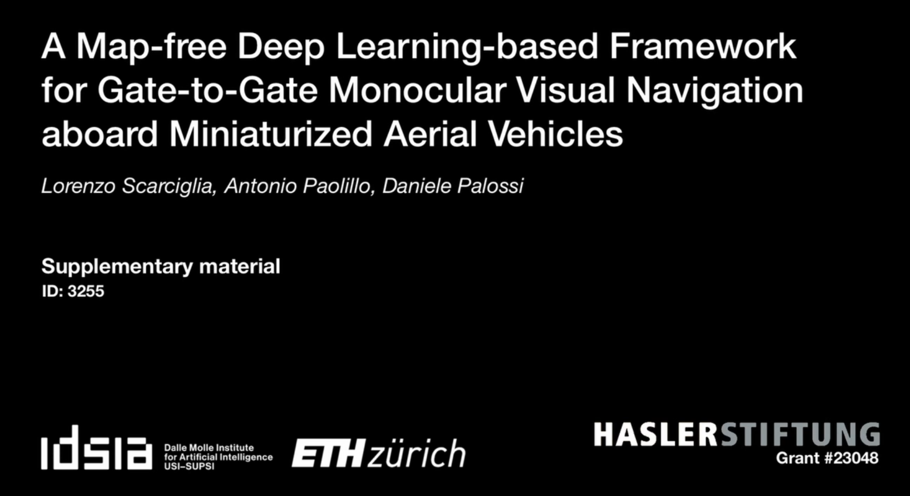

## ICRA'25 3255 — Supplementary video material
A Map-free Deep Learning-based Framework for Gate-to-Gate Monocular Visual Navigation aboard Miniaturized Aerial Vehicles

### Authors
Lorenzo Scarciglia1,
Antonio Paolillo1,
Daniele Palossi1,2

1 Dalle Molle Institute for Artificial Intelligence (IDSIA), USI and SUPSI, Lugano, Switzerland. 
2 Integrated Systems Laboratory (IIS), ETH Zürich, Zürich, Switzerland. 

<a href="https://youtu.be/jxOR3Ncbixs">
  <b>In-field experiments video</b>
   
   
</a>

<iframe width="560" height="315" src="https://www.youtube.com/embed/jxOR3Ncbixs" title="ICRA&#39;25 -- Paper ID 3255" frameborder="0" allow="accelerometer; autoplay; clipboard-write; encrypted-media; gyroscope; picture-in-picture; web-share" referrerpolicy="strict-origin-when-cross-origin" allowfullscreen></iframe>
